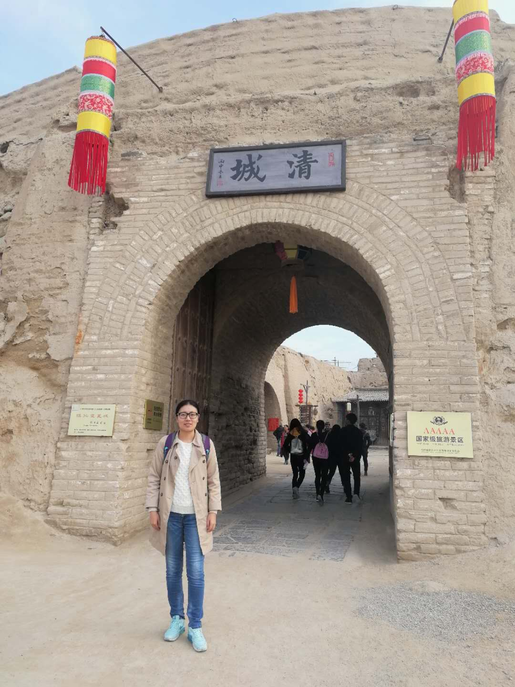

>姓名：刘贝贝

>中南财经政法大学金融学院金融学博士生

## 介绍

刘贝贝，河南襄城县人，2016级博士研究生。有论文发表在《经济研究》、《金融研究》、《南方经济》。

2013年9-2016年6月 中南财经政法大学金融学院
2015年6月-2017年1月 香港岭南大学财务保险系--研究助理
2016年9-至今 中南财经政法大学金融学院

荣誉：研究生期间两次获得国家奖学金,2017年鸿儒奖学金。

## 技术方向

使用Stata进行数据处理、图形绘画和数据挖掘

## 研究方向

公司治理、卖空机制和信息披露等

## 学术成果

李春涛,刘贝贝,周鹏. 卖空与信息披露：融券准自然实验的证据[J]. 金融研究，2017第9期；
张璇,刘贝贝,汪婷,李春涛. 信贷寻租、融资约束与企业创新[J]. 经济研究，2017第5期；
张璇，刘贝贝，胡颖.吃喝腐败、税收寻租与企业成长——来自中国企业的经验证据[J]. 南方经济，2016第11期；
